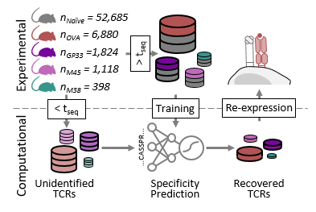

# TCRprediction

This directory contains the training and evaluation code of the binding
specificity models.



## Steps to reproduce the results and figures

### 1. Data

The data and saved models will be published with the accepted manuscript. If you have received a copy of the submitted manuscript, please use the
preview access Zenodo link in that manuscript. Download the preprocessed
supplementary data and saved models from Zenodo, then extract and move the input data
to `data/<epitope>_with_background.csv`, results to `results/<epitope>_prediction_scores.csv`, 
and the saved models to `saved_models/<epitope>/<epitope>_<0-4>_group_stratified.ckpt`.

Each `data/<epitope>_with_background.csv` holds the epitope-specific TCRs
together with the antigen-unselected naive background. Three columns are
required by `TCRSatDataset`:

- **`full`**: the full-length paired alpha and beta amino acid sequence, used
  as model input.
- **`specificity`**: the prediction target, either the epitope name or
  `not_identified` for the naive background.
- **`group_stratified_split_0` to `_5`**: the `train`/`val`/`test` assignment
  of the six grouped splits, selected through the `split_col` option. Note, split 5 
  was used as the held-out test set.

The results csvs contain the binding scores on the training, validation, and test set for reproducibility. 
The final predictions scores used to filter the library are contained in the Supplementary Materials. 

### 2. Installation

```bash
git clone https://github.com/AdrianStraub/Straub_An_et_al_2026_The-total-epitope-specific-T-cell-receptor-solution-space.git
cd Straub_An_et_al_2026_The-total-epitope-specific-T-cell-receptor-solution-space/TCRprediction
conda create --name tcrPrediction -y
conda activate tcrPrediction
conda install python=3.10.13
conda install nb_conda_kernels -y
pip install -r requirements.txt
```

This directory uses its own environment, as it contains a different suite of
libraries than the main repository. The installation takes around 10 min to complete. Tested on MacOS 26.6 and Linux Rocky 9. While the code runs on any
standard hardware, a GPU is recommended to accelerate the computation time by orders of magnitudes.

### 3. Notebooks

Run the notebooks in `analysis/` with the `tcrPrediction` kernel.

- **`01_performance.ipynb`**: reproducing performance metrics of the binding specificity
  predictors on the test set.
- **`02_manuscript_figures.ipynb`**: reproducing figures of the predictor evaluation.
- **`03_binding_score.ipynb`**: reproducing predicted binding values as reported in the Supplementary Materials. By default on a subset
of 1000 samples as a fast option to run in ~1 h on a machine without GPU. Can be increased or set to False for the full dataset.

## Training

To train the predictors a machine with GPU support is required. The
hyperparameter optimization shown in our manuscript was performed on one
single A100 or H100 GPU machine with 40 or 80 GB of memory, for each epitope
and split individually for 48h.

```bash
./scripts/run_training.sh <epitope> <split>
```

If you would like to train it on your own data, please follow the dataframe format described in `1. Data`.

### 4. Demo

A demonstration notebook on how to train and evaluate your own model is contained in  `analysis/04_demo.ipynb` using 100 sample TCRs provided alongside the repo. Note, that performance will be only limited due to limited amount of data and no hyperparamter optimization. The expected run-time of the demo on a GPU-node is approx. 10 minutes.
